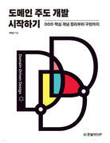

# Domain Driven Design Deep Dive

## Description

This repository is dedicated to a comprehensive study and implementation of Domain-Driven Design (DDD). 

It is aimed at beginners and experienced developers alike who are interested in learning and applying the principles of DDD in software development.

## Topics

- **Concepts of DDD**: Understanding of Domain-Driven Design principles, focusing on the importance of domain modeling and strategic design in software development.
  
- **Implementing DDD**: Applying the learned concepts of DDD, this covers the actual implementation, enhancing practical skills through exercises and real-world examples. 

## Reference

| 
도메인 주도 개발 시작하기
 |
|----------|
| 

 |