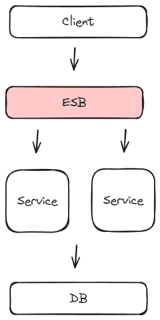

# 모놀리스 아키텍처 (Monolithic Architecture)

## 개요

모놀리스 아키텍처는 하나의 어플리케이션에서 모든 서비스와 기능이 통합되어 있는 구조입니다. 이는 다음과 같은 특징을 가집니다:

1. 단일 코드베이스: 모든 기능과 서비스는 하나의 코드 저장소에서 개발되고 관리됩니다.
2. 공유 데이터베이스: 어플리케이션의 모든 부분이 동일한 데이터베이스를 사용합니다. 데이터 관리를 간소화하지만, 데이터베이스에 대한 의존성이 높아집니다.
3. 전체 애플리케이션 재배포: 코드의 일부분에 변경이 생겨도 전체 어플리케이션을 다시 배포해야 합니다. 업데이트 시간이 길어질 수 있으며, 전체 시스템에 영향을 줄 수 있습니다.
4. 통합 배포 프로세스: 싱글 모듈 또는 멀티 모듈 구조를 채택할 수 있으나, 모든 모듈이 하나의 프로세스로 묶여 배포됩니다.

## 종류

### 싱글 모듈

- 통합된 구조: 모든 코드와 서비스가 하나의 모듈 안에 통합되어 있습니다. 이로 인해 모든 부분이 서로 밀접하게 연결되어 있어, 변경 사항이 전체에 영향을 미칠 수 있습니다.
- 고응집성 및 강결합: 기능들이 서로 긴밀하게 연결되어 있어, 변경 관리와 이해가 쉽지만, 유연성과 확장성은 제한적입니다.
- 단일 배포 단위: 변경이 있을 때 전체 어플리케이션을 하나의 JAR 파일로 묶어서 배포합니다. 이는 배포 과정을 단순화시키지만, 전체 어플리케이션의 크기와 복잡성에 따라 배포 시간이 길어질 수 있습니다

### 멀티 모듈

- 모듈화된 구조: 어플리케이션의 각 기능이 별도의 모듈로 분리되어 있습니다. 이는 각 모듈이 특정 역할이나 서비스에 집중할 수 있게 합니다.
- 낮은 결합도와 적절한 응집성: 모듈 간의 의존성이 싱글 모듈보다 낮아, 각 모듈이 더 독립적으로 작동합니다. 이는 유연성과 확장성을 향상시킵니다.
- 집합적 배포: 여러 JAR 파일로 구성되며, 이들을 함께 하나의 프로세스로 배포합니다. 이는 각 모듈을 독립적으로 관리하면서도 통합된 어플리케이션으로 배포할 수 있게 합니다.

## 장단점

### 장점

- 공통 모듈의 용이한 활용: 모놀리스 구조에서는 공통 기능이나 라이브러리를 모듈로 만들어 쉽게 재사용할 수 있습니다. 이는 코드의 중복을 줄이고 일관성을 유지하는 데 도움이 됩니다.
- 서버 리소스 최적화와 용이한 유지보수: 모든 서비스가 하나의 어플리케이션에 통합되어 있어, 서버 리소스를 효율적으로 관리할 수 있습니다. 또한 단일 어플리케이션 구조는 관리와 유지보수가 비교적 간단합니다.
- 단순한 배포 프로세스: 전체 어플리케이션이 하나의 단위로 배포되므로, 배포 과정이 단순하고 직관적입니다. 이는 배포 관리를 용이하게 합니다.

### 단점

- 수평 확장의 어려움: 모든 서비스가 하나의 데이터베이스와 통합된 코드베이스에 의존하기 때문에, 수평적으로 확장하기 어렵습니다. 이는 특히 트래픽이 높은 서비스의 확장에 제약을 줄 수 있습니다.
- 부분적 확장의 불가능성: 특정 기능의 사용량이 증가할 때, 그 부분만을 개별적으로 확장하는 것이 어렵습니다. 클라우드 환경에서는 사용량에 따라 리소스를 조정할 수 있지만, 모놀리스 구조에서는 전체 어플리케이션의 확장이 필요하게 되어 비효율적일 수 있습니다.
- 전체 시스템에 대한 장애 영향: 한 부분에 문제가 발생하면 전체 어플리케이션에 영향을 미칠 수 있습니다. 이는 시스템의 안정성과 가용성에 큰 위험을 가져올 수 있습니다.

## SOA (Service Oriented Architecture)

SOA는 서로 다른 서비스들이 네트워크를 통해 통신하고 상호작용하는 아키텍처 패턴입니다. 이러한 서비스들은 재사용 가능하며, 표준화된 인터페이스를 통해 독립적으로 연결되어 있습니다.

### ESB (Enterprise Service Bus)

ESB는 SOA 환경에서 중요한 구성 요소로, 서로 다른 시스템, 애플리케이션, 서비스 간의 통합을 담당합니다.ESB의 사용은 서비스 간의 통신을 표준화하고 중앙에서 관리할 수 있게 해줍니다.

### 고려할 사항

새로운 서비스가 SOA 환경에 추가될 때, 해당 서비스를 통합하기 위한 로직이 ESB에 추가되어야 합니다. 즉, 서비스들을 독립적으로 배포할 수 있지만 ESB에 대한 의존성이 높아집니다.

SOA는 이러한 특징을 가진 아키텍처로, 서비스의 재사용성과 통합을 강조하지만, 중앙 집중식 관리와 ESB에 대한 의존성이 핵심 고려사항이 됩니다.

