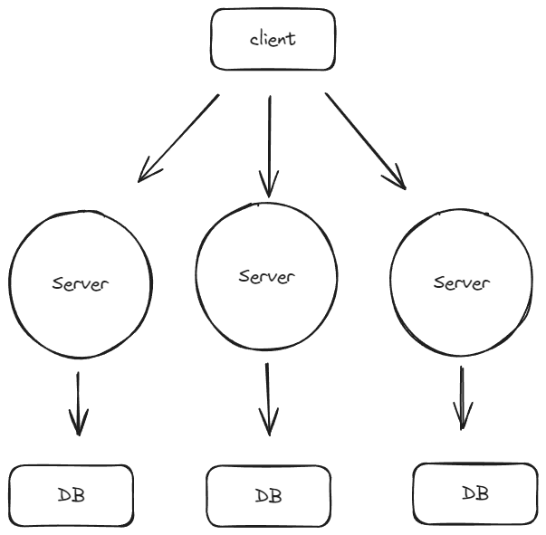
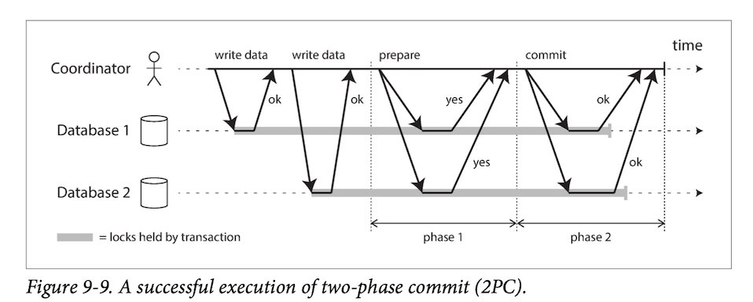
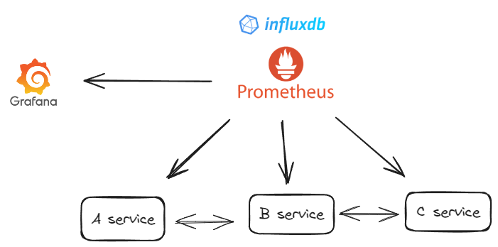

# MSA (Microservice Architecture)

## 등장 배경

MSA의 등장은 현대 IT 환경의 복잡성과 **빠르게 변화하는 비즈니스 요구에 대응**하기 위한 아키텍처 패러다임의 변화에서 비롯되었습니다.

1. 기존 아키텍처의 한계 극복: 기존의 모놀리스 아키텍처와 SOA는 대규모 시스템에서 유지보수, 확장성 및 빠른 변화에 대응하는 데 한계를 가지고 있었습니다
2. 빠른 배포와 지속적 통합 필요성 증가: 빠르게 변화하는 시장 요구와 지속적인 기술 혁신에 능동적으로 대응할 필요가 있습니다. 이를 위해 더 작고 독립적인 단위로 서비스를 구성하고, 빠른 배포와 지속적인 업데이트가 가능한 아키텍처가 요구되었습니다.
3. 독립적인 서비스 운영의 필요성: 각 서비스 마다 독립적으로 업데이트하고 확장할 필요성이 높아졌습니다. 이를 위해 서비스 간의 의존성을 최소화하고, 서비스별로 필요한 리소스를 독립적으로 관리할 수 있는 아키텍처가 필요했습니다.
4. 클라우드 컴퓨팅의 활용 증가: 클라우드 환경에서 마이크로서비스가 필요한 만큼 리소스를 독립적으로 확장하고 관리할 수 있으며, 서비스 간의 연결 및 조정이 용이해졌습니다.

## 개요

MSA는 복잡한 애플리케이션을 작고, 독립적인 서비스 단위로 분할하는 아키텍처 패턴입니다.

1. 경량 통신 아키텍처: MSA는 ESB에 의존하지 않고, REST, gRPC, Kafka 등과 같은 경량의 통신 아키텍처를 주로 사용합니다.
2. 독립적인 서비스 개발 및 배포: 각 마이크로서비스는 독립적으로 개발되고 배포됩니다. 이는 각 서비스가 자체적인 개발주기를 가지며, 유연한 기술 스택 적용이 가능합니다.
3. 서비스별 Scale-Out: 각 마이크로서비스는 서비스별 부하에 따라 개별적으로 확장(scale-out)이 가능합니다.
4. 지속적인 배포: 각 서비스는 독립적으로 배포되며, 지속적인 배포(CD)가 중요해졌습니다.

## 장단점

### 장점

- 빠른 개발 및 유지보수: 각각의 서비스가 모듈화되어 있어 개별적인 개발과 유지보수가 용이합니다.
- 기술 스택의 유연성: 다양한 기술 스택을 독립적으로 적용할 수 있어, 예를 들어 Java 기반 시스템 내에서도 Node.js를 이용한 개발이 가능합니다.
- 지속적인 배포와 확장성: 독립적인 서비스 구조로 인해 지속적인 배포(CD)가 용이하며, 서비스별로 필요한 리소스를 효율적으로 확장할 수 있습니다.

### 단점

- 복잡성 증가: 서비스 간의 통신과 분산된 시스템 구조로 인해 개발 및 관리의 복잡성이 증가합니다.
- 트랜잭션 관리의 어려움: 분산된 서비스 구조로 인해 트랜잭션을 유지하는 것이 어렵고, 서비스 간 일관성을 관리하는 것이 복잡합니다.
- 통합 테스트와 배포의 어려움: 개발 환경과 운영 환경 간의 일치성 유지가 어렵고, 서비스 간의 상호 의존성으로 인해 배포 시 여러 문제가 발생할 수 있습니다.

## MSA가 어려운 이유

### IPC 통신

다른 서비스를 호출하기 위해 HTTP, gRPC 통신을 해야한다. 통신에 대한 기본적인 이해가 필수적을 필요해진다.

**통신에서 발생하는 문제들**

1. keep alive 제대로 설정이 안되어있으면 과부하인 상황에서 비효율적으로 커넥션을 관리하게 된다.
2. Connection Pool이 부족하면 서버가 커넥션 수 설정을 하지 않았거나 인프라의 능력이 부족한 것입니다.
3. Connection Timeout은 방화벽에 관련된 문제일 가능성이 높습니다.
4. 비지니스 로직에 대한 타임아웃인 경우 호출하는 서비스 자체에 문제가 있다고 볼 수 있습니다.

### 트랜잭션 관리

MSA에서는 각 서비스가 독립적인 데이터베이스를 가지고 있다보니 한 서비스 내에서만 유효한 @Transaction을 사용할 수 없으며 여러 서비스에 걸친 트랜잭션을 관리하기 어렵습니다.

**보상 트랜잭션**

한 서비스에서 처리한 작업을 다른 서비스의 실패로 인해 취소해야 할 경우, 이를 되돌리기 위한 '보상 트랜잭션'을 수행합니다. 

e.g. 실패를 인지한 서비스가 통신을 통해 다른 서비스에게 롤백을 요청합니다.

Saga가 내부적으로 보상 트랜잭션을 사용하고 있습니다.

**2PC(Two-Phase Commit)**

트랜잭션의 일관성을 보장하기 외해 2번에 걸친 커밋을 통해 진짜 커밋을 표현하는 방법입니다.

MSA에서는 가능한 한 트랜잭션을 사용하지 않는 로직을 구현하는 것이 좋습니다.

### 데이터 쿼리

모놀리스에서는 Join을 통해 간단하게 해결 가능하지만 MSA에서는 각 서비스가 독립된 데이터 소스를 가지고 있어, 여러 데이터베이스에서 데이터를 조합해야 하는 경우 데이터를 수집하고 조합하는 방법을 고민해야 합니다.

**API 조합 패턴**

MSA에서는 각 서비스가 독립된 데이터 소스를 가지고 있어, 여러 데이터베이스에서 데이터를 조합해야 하는 경우가 많습니다. 이때 각 서비스에서 제공하는 API를 조합하여 필요한 데이터를 수집하고 결과를 조합하는 방식을 사용합니다.

**CQRS (Command Query Responsibility Segregation) 패턴**

CRUD(Create, Read, Update, Delete)에서 CUD(Command)와 R(Query) 작업을 명확하게 구분하는 아키텍처 패턴입니다.

API 조합이 여러 번의 호출을 필요로 하고 비효율적일 수 있기 때문에 CQRS 패턴이 도입되었습니다.

- 명령(CUD)와 쿼리(R)을 분리함으로써 각 작업을 독립적을 최적화할 수 있습니다.
- 데이터 일관성을 더욱 쉽게 관리하고 격리할 수 있습니다. 이로 인해 하나의 마이크로서비스의 데이터 변경이 다른 마이크로서비스에 미치는 영향을 최소화할 수 있습니다.
- 각 마이크로서비스를 독립적으로 확장할 때 CQRS 패턴을 적용하면 읽기 작업을 위한 쿼리 서비스를 수평으로 확장하기 용이합니다.

### 모니터링

모놀리스 환경에서는 하나의 node만 모니터링하면 되지만, MSA 환경에서는 여러 node를 모니터링해야 합니다. 추가적으로 서비스 간 응답과 네트워크 상태를 확인해야합니다.

e.g. A -> B -> C를 호출 하는 상황에 평균적으로 0.1초 걸리던 것이 0.3초로 늘어난 경우 어느 서비스부터 문제가 생겨서 연쇄적으로 느려지기 시작했는 지 파악을 해야합니다.
서비스간의 응답 코드 갯수의 추이, 각 서비스의 지연시간, 에러율 등을 모니터링해서 원인을 찾아 해결할 수 있습니다. 

**프로메테우스 pull, push 방식**

프로메테우스가 각각 노드 서비스에 5~10초마다 주기적으로 metric(node 서비스의 상태 등)을 요청해 가져옵니다. 가져오는 작업을 위해서 서비스에 부담을 주는 것은 좋은 방법이 아니기 때문에 일반적으로 pull 방식을 사용합니다.(기본값)
그러나 cronjob과 같이 주기적으로 가져오는 것이 아닌, 이벤트가 발생할 때마다 가져와야 하는 경우에는 push 방식을 사용합니다. 

> influxDB는 시간에 따라 변화하는 데이터(시계열 데이터)를 저장하는 데이터베이스입니다.  
> Grafana는 influxDB에 저장된 데이터를 시각화하는 도구입니다.

## MSA Design for Failure

시스템에 언제든지 문제가 생길 수 있음을 인정해야합니다.

### 감지 - Circuit Breaker

서비스 간의 통신에서 장애가 발생할 경우, 장애가 전파되지 않도록 회로를 차단합니다.
예를 들어 A->B->C에서 C로 가는 통로에 문제가 생겼을 때, 에러 임계점을 넘어가면 통로를 닫고 C를 대체하기 위한 로직 or 서비스(D)를 호출합니다. 그리고 정상화되면 다시 C로 통로를 열어줍니다.
B->C로 갈 때 장애가 발생하면 처리책임을 B가 가지게 된다.

### 복구 - k8s

감지되면 복구를 해야하는데 k8s를 사용할 수 있습니다. 

k8s는 Rediness Probe, Liveness Probe를 활용하여 서비스를 지속적으로 감시하고 있고 장애가 발생하면 재시작하는 등의 복구 작업을 수행할 수 있습니다.

### 의도치 않은 결과 방지 - 트랜잭션

A->B->C 요청 흐름에서 C에서 데이터베이스에 반영이 되었지만 B에서는 실패 응답을 받았다고 가정하곘습니다.
트랜잭션 처리에서 의도치 않은 결과를 방지하기 위해 이벤트 주도 방식을 사용할 수 있습니다. 

A에서 발생한 이벤트를 메세지 큐에 저장, B에서 이 큐에서 이벤트를 받아 처리합니다. C에서 DB에 데이터가 반영되면 이를 알리는 성공 이벤트가 생성되고, 이 이벤트는 다시 B로 전달됩니다
메시지 브로커가 정상 작동하는 한 C가 실패했다 하더라도 브로커에는 성공적인 처리 기록이 남아서 B가 이를 받아 처리할 수 있습니다.

메세지가 전달되는지 여부에 따라 처리방식이 달라질 수 있습니다.

메시지가 성공적으로 전달되었지만 응답이 실패로 처리된 경우, 그 응답을 성공으로 변경할 수 있습니다.

메시지가 전달되지 않은 경우, C가 정상적으로 돌아오면 이를 전달하여 B가 실패한 요청을 정상적인 처리로 변경할 수 있습니다.

### Chaos Test

강제로 문제를 발생시켜서 서비스 간의 의존성을 파악하고, 장애가 발생했을 때 어떤 서비스가 영향을 받는지를 파악하는 테스트를 수행합니다. 
