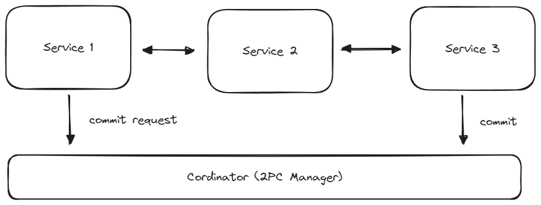
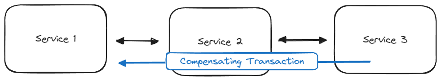
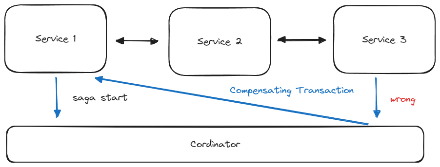

# MSA 패턴

MSA (Microservices Architecture) 패턴에서는 모놀리식 시스템을 마이크로서비스로 분해하여 발생할 수 있는 문제들을 해결하기 위한 다양한 패턴들이 존재합니다. 

## 분해 패턴

모놀리식 시스템에서 하나의 서비스를 여러 개의 마이크로서비스로 분리하는 방법에 대한 패턴입니다.

### 비즈니스 능력에 따른 분해

각각의 서비스가 특정 비즈니스 능력이나 기능을 중심으로 구성되도록 합니다. 예를 들어, '송금'이라는 비즈니스 능력을 중심으로 한 서비스를 만들 수 있습니다.

서비스 간 통신이 빈번하고 비즈니스 로직이 복잡한 경우에 적합합니다. 서비스는 서로 밀접하게 연결되어 복잡한 비즈니스 프로세스를 처리합니다.

비즈니스 로직의 명확한 분리를 가능하게 하지만, 서비스 간 종속성과 복잡성이 증가할 수 있습니다.

### 하위 도메인 패턴별 분해 (도메인 주도 설계 기반)

도메인 주도 설계(DDD)의 원칙에 따라, 전체 시스템을 여러 하위 도메인으로 나누고 각 도메인을 별도의 서비스로 구현합니다.

복잡한 시스템을 더 작고 관리 가능한 부분으로 나누고자 할 때 적용됩니다. 각 서비스는 독립적인 비즈니스 규칙과 데이터를 갖습니다.

서비스 간의 독립성을 강화하고 장애 영향을 최소화합니다. 그러나 서비스 간에 불필요한 통신이 발생할 가능성이 높고 지나치게 많은 서비스로 분리될 가능성도 존재합니다.

## 통신 패턴

서비스 간 어떤 방식으로 통신을 할 지 결정하는 패턴입니다.

### Sync Pattern (동기 패턴)

한 서비스가 다른 서비스에 요청을 보내고, 그 응답을 받기 전까지는 해당 요청을 보낸 서비스가 대기 상태에 있는 패턴입니다.

e.g. HTTP(Restful), gRPC

### Async Pattern (비동기 패턴)

한 서비스가 다른 서비스로 요청을 보내고, 응답을 받지 않아도 자신의 다른 작업을 계속 진행할 수 있는 패턴입니다.

**이벤트 기반 비동기 (Event-based Asynchronous)** 

서비스 A가 서비스 B에 요청을 보내고, 서비스 B가 언제든 응답할 준비가 되면 서비스 A에 알리는 방식입니다. 이때, 콜백 함수나 이벤트 리스너가 사용될 수 있습니다.

**폴링 기반 비동기 (Polling-based Asynchronous)**

서비스 A가 서비스 B에 요청을 보내고, 그 요청에 대한 응답을 바로 받지 않습니다. 대신 서비스 A는 일정 주기로 서비스 B에 요청이 성공했는지 확인하는 폴링(polling) 방식을 사용합니다.

e.g. Kafka 등을 이용한 메세징 큐

## 트랜잭션 패턴

분산된 환경에서 일관성과 데이터의 무결성을 유지하기 위한 트랜잭션을 적용하기 위한 패턴입니다. 가능하다면 다른 수단을 통해서 트랜잭션 패턴을 사용하지 않아도 되는 상황을 만드는 것이 가장 좋은 방법입니다.

### 2PC (2Phase Commit)

2단계에서 걸쳐서 트랜잭션을 완료를 결정하는 것입니다. 

1단계 (준비 단계): 이 단계에서 코디네이터는 참여하는 모든 서비스에 트랜잭션 커밋 준비를 요청합니다. 각 서비스는 트랜잭션을 준비하고, 준비가 완료되었음을 코디네이터에게 알립니다.

2단계 (커밋/롤백 단계): 모든 서비스가 준비되면 코디네이터는 트랜잭션 커밋을 지시합니다. 만약 어느 한 서비스라도 준비에 실패했다면, 코디네이터는 트랜잭션 롤백을 지시합니다. 이 단계에서는 1단계에서 진행된 작업을 실제로 완료하거나, 작업이 실패했을 경우 취소합니다.

만약 코디네이터가 실패하거나, 코디네이터와 서비스 간의 네트워크 문제가 발생하는 경우, 전체 트랜잭션 프로세스가 중단되거나 지연될 수 있습니다. 이러한 이유 때문에 2PC는 불안정한 트랜잭션 패턴이라고 할 수 있습니다.

### Compensating Transactions (보상 트랜잭션)

분산 시스템에서 이미 완료된 트랜잭션을 '취소'하는 방법입니다. 기존의 롤백 작업과는 다르게, 이미 커밋된 트랜잭션에 대해 역작업을 수행하는 새로운 트랜잭션을 생성합니다.

e.g. 계좌 A에서 B로 돈을 이체한 후에 이체를 취소하고자 할 때, 단순히 이전 트랜잭션을 없던 것으로 하는 것이 아니라, B에서 A로 돈을 다시 이체하는 새로운 트랜잭션을 발생시킵니다.

### Saga Pattern (사가 패턴)

2PC와 보상 트랜잭션의 장점을 살린 것이 사가 패턴입니다.

여러 개의 로컬 트랜잭션을 하나의 글로벌 트랜잭션으로 관리하는 방법입니다. 이 패턴은 각각의 로컬 트랜잭션이 성공적으로 완료되면 다음 트랜잭션을 진행하고, 만약 어느 하나에서 실패가 발생하면 이전에 성공적으로 완료된 트랜잭션들에 대한 보상 트랜잭션을 실행합니다. 

2PC랑 마찬가지로 코디네이터에 요청 자체가 오지 않을 때에는 사가가 시작되고 난후에 타임아웃을 설정하여 성공 or 실패가 오지않는다면 자동적으로 보상 트랜잭션을 실행시키게 하는 로직을 사용할 수도 있습니다.

## 데이터 쿼리 패턴

MSA 환경에서 데이터 쿼리의 어려움을 해결하기 위한 패턴입니다.

### API Aggregation (API 조합) 패턴

필요한 데이터를 분리된 서비스들에게 각각 요청하여 얻어오고 조합하는 방법입니다.

### CQRS (Command Query Responsibility Segregation) 패턴

CQRS 패턴은 Command (Write, Update, Delete)와 Query (Read) 작업의 엔드포인트를 분리합니다. 이 패턴의 핵심은 Read와 Command에 대한 서비스를 별도로 구성하는 것입니다. 이를 통해 복잡한 비즈니스 데이터 쿼리를 더 효율적으로 처리할 수 있습니다.

Command 작업은 기존의 방식과 동일합니다. 그러나 Query 작업은 복잡한 비지니스 데이터 쿼리를 사전에 정의하여 만들어 두는 것입니다.

**예시**

강남구에 사는 모든 주민들의 선불 금액 잔액 총합을 알고자 할 때, 계좌 서비스와 고객 서비스가 분리되어있다고 가정하겠습니다. 

이때 API 조합 방식을 사용하면 계좌를 모두 조회한 후, 각 계좌의 고객 정보를 조회하여 강남구에 사는지 확인해야 합니다. 계좌가 총 1000만개라면 최소 1000만번이상 계좌서비스를 호출해야합니다.

