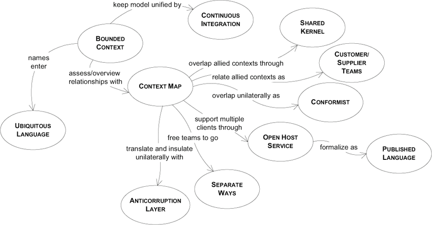
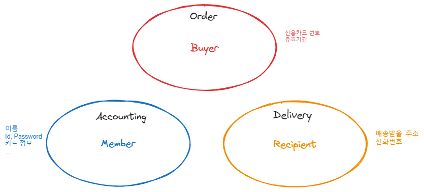
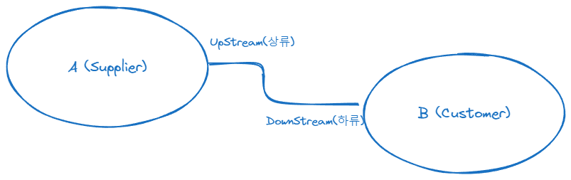
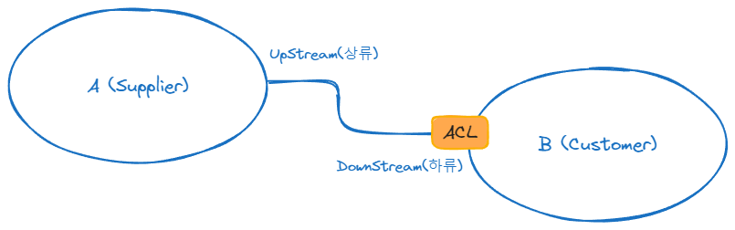
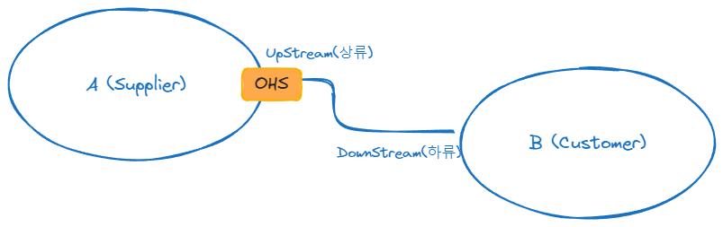

# 도메인 주도 설계 (Domain Driven Design)

도메인 주도 설계는 도메인과 도메인 로직 자체에 초점을 맞춘 설계 방식입니다.

MSA는 내부의 응집성을 강화하고 외부의 결합도를 낮추는 것을 목표로 하며, 이를 위해 도메인 주도 설계을 적용하는 것이 효과적입니다.

# 전략적 설계 (Strategic Design)

전략적 설계는 시스템의 전체 구조와 방향을 정의하는 과정입니다.  
전체 비즈니스 도메인을 이해하고, 세부 하위 도메인으로 나누어 각각의 역할과 경계를 명확히 하고 관계를 설정합니다.

## 중요성

### 비즈니스 이해  

- 시스템을 제대로 구축하려면 비즈니스 도메인을 깊이 이해해야 합니다. 
- 문제를 파악하고 해결하기 위해서는 해당 문제가 발생하는 맥락(Context)을 알아야 합니다.

### 도메인 분리

- 비즈니스는 여러 주요 활동 영역, 즉 도메인으로 구성됩니다. 이러한 도메인들을 이해하고 분리하는 것은 시스템 설계에 매우 중요합니다.

## 하위 도메인 (Sub Domain)

하위 도메인은 큰 비즈니스 도메인을 구성하는 세부 영역입니다.

### 핵심 도메인 (Core Domain)

핵심 도메인은 회사의 주요 경쟁력이 되는 중요한 부분으로써 복잡하지만 비즈니스의 핵심 가치를 제공합니다.

우버의 손님 매칭 서비스, 구글의 검색 알고리즘을 예시로 들 수 있습니다.

### 일반 도메인 (Generic Domain)

일반 도메인은 대부분의 회사가 비슷한 방식으로 수행하는 일반적인 도메인으로 내용이 복잡할 수는 있지만 직접적인 경쟁력을 제공하지는 않습니다.

### 지원 도메인 (Supporting Domain)

지원 도메인은 비즈니스를 지원하는 활동으로 상대적으로 기능이 단순합니다.

기본적인 CRUD 작업을 예시로 들 수 있습니다.

## 유비쿼터스 언어(Ubiquitous Language)

모든 팀원(개발자, 비즈니스 전문가, 사용자 등)이 공유하는 공통 언어입니다.  
비지니스 도메인을 정확하게 반영하고, 기술적 오염을 최소화하며, 도메인 지식을 코드로 직접적이고 명확하게 표현하기 위해 사용합니다.

### 장점

1. 유비쿼터스 언어를 사용하면 실제 비지니스 프로세스, 정책, 규칙을 코드에 직접적으로 표현할 수 있습니다.

2. 모든 이해관계자가 동일한 용어를 사용함으로써 커뮤니케이션의 명확성과 효율성을 향상시킵니다.

### 예시

- 피자 주문 시 30분 내 도착하지 않으면 쿠폰 발행"과 같은 비즈니스 규칙을 직접적인 코드 형태로 표현합니다.
- 계약이라는 애매한 용어보다 보험계약 혹은 자동차 보험계약과 같이 도메인에 특화된 용어를 사용합니다.

## 바운디드 컨텍스트 (Bounded Context)

도메인 모델의 경계를 정의하는 개념으로, 특정 모델의 유효한 맥락(컨텍스트)의 경계를 나타냅니다.  

### 특징

1. 각각의 도메인 모델은 해당 바운디드 컨텍스트 내에서만 정의되고 적용됩니다.
2. 각 바운디드 컨텍스트 내에서 유비쿼터스 언어의 일관성이 유지되어야 합니다.
3. 같은 용어가 다른 컨텍스트에서 다른 의미를 가질 수 있습니다. 예를 들어, '고객'이라는 용어는 주문 컨텍스트에서는 주문자를, 배송 컨텍스트에서는 수령인을 의미할 수 있습니다.

## 도메인 모델링

도메인 모델은 비즈니스의 중요한 부분(문제, 요구사항 등)을 객체들의 관계로 나타내고, 이를 모두가 이해할 수 있는 공통 언어(유비 쿼터스)로 표현하는 것입니다.

모델링의 핵심 목적 중 하나는 복잡한 현실을 단순화하여 추상적으로 표현하는 것입니다. 이는 지하철 노선도가 실제 지형을 단순화하여 직관적으로 표현하는 것과 유사한 원리를 따릅니다.

도메인 모델링도 마찬가지로 도메인을 단순화하여 표현하는 과정입니다.

### 표현 및 주의점

바운디드 컨텍스트 내에 도메인 모델이 정의되고 이 모델을 유비쿼터스 언어로 표현합니다.

주의할 점은 여러 곳의 바운디드 컨텍스트에서 필요한 정보를 한곳에서 보관한다면 필요할 때마다 여러 마이크로서비스가 동일한 데이터에 접근해야하고, 이는 결국 결합도가 높아지는 것을 의미합니다. 
이를 방지하기 위해 도메인 모델을 통해 각 마이크로서비스가 필요한 데이터만을 가지도록 하는 것이 중요합니다.

## 컨텍스트 매핑 (Context Mapping)
 
바운디드 컨텍스트는 독립적으로 발전할 수 있지만, 상호작용이 필요합니다. 
이때 바운디드 컨텍스트들 간의 관계를 정의하는 방법이 컨텍스트 매핑입니다.

### 협력형 패턴

두개의 바운디드 컨텍스트가 서로 밀접하게 파트너 관계로 의사소통 되고 있는 경우입니다.  
이때 두개의 바운디드 컨텍스트가 공통으로 사용하는 영역(셰어드 커널, Shared Kernel)이 있습니다. 주의할 점은 셰어드 커널은 과도하게 사용되어서는 안됩니다.

### 공급자, 소비자 패턴

대부분의 관계는 공급자(서비스 제공자)와 소비자(서비스 사용자)로 구성됩니다.

상류에서 제공하는 모델을 그대로 사용하는 **순응주의자** 패턴은 상류의 변경에 따라 영향을 받습니다.  

상류 모델을 직접 사용하지 않고 ACL(Anti-Corruption Layer)를 통해 변환하여 사용하는 **안티 크러시스트** 패턴은 상류의 변경으로부터 하류를 보호합니다.

**OHS(Open Host Service)** 패턴은 표준화된 인터페이스와 공표된 언어(PL, Public Language)를 통해 서비스를 제공하는 방식입니다.

 

**분리형 노선(Seperate Ways)** 패턴은 협력보다는 기능의 중복을 택하는 방식입니다. 특정 기능을 각자의 방식으로 독립적으로 구현하는 것이 더 경제적일 때 선택됩니다.

