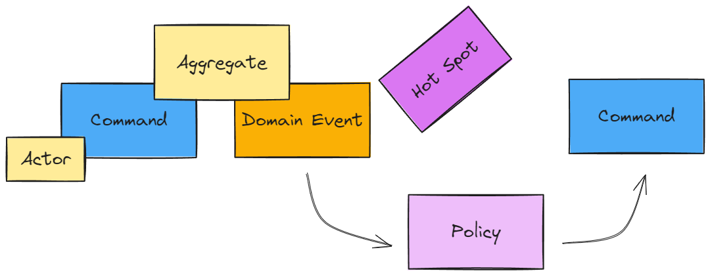
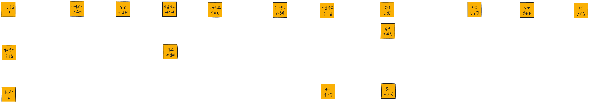
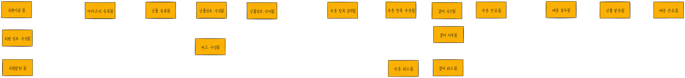

# 이벤트 스토밍 (Event Storming)

서비스에서 발생하는 주요 이벤트를 중심으로 도메인 모델을 만드는 방법입니다. 이벤트 스토밍을 통해 도메인 주도 설계를 쉽게 할 수 있습니다.

벽에 포스트잇을 붙여가면서 도메인 모델을 만드는 방법입니다. 비지니스를 이해하고 토론하는 과정에서 도메인 개념을 규정하고 그것을 모델로 만듭니다.

## 포스트잇 종류

### 도메인 이벤트(Domain Event)

- 서비스에서 발생하는 주요 이벤트(사건)를 의미합니다. 
- 그래서 과거형 동사로 표현을 하고 포스트잇 색상은 Orange 입니다.
- 데이터가 아닌 비지니스 프로세스에 집중합니다.

### 핫스팟(Hotspot)

- 질문, 가정, 경고, 의견 수렴이 필요한 내용을 의미합니다.
- 병목구간, 자동화 필요한 수작업, 도메인 지식이 없는 경우 해당 내용의 포스트잇을 붙입니다.
- 필요한 곳 어디에나 비스듬이 부착하고 Purple 색상입니다.
- 예를 들어 자동화 작업을 해야할 것 같은 의문점이 있는 곳에 붙입니다.

### 커맨드(Command)

- 도메인 이벤트를 발생시키는 명령(트리거)을 의미합니다.
- 현재형 동사로 표현을 하고 포스트잇 색상은 Blue 입니다.
- 예를 들어 회원등록됨 이라는 도메인 이벤트를 발생시키는 것은 회원등록이라는 커맨드입니다.
- 모든 도메인 이벤트는 커맨드와 한 쌍입니다.

### 액터(Actor)

- 커맨드를 동작하는 사용자, 역할을 의미합니다.
- 사람이나 역할의 이름을 명사(단어)로 표현하고 포스트잇 색상은 Yellow 입니다.
- 커맨드하고 도메인 이벤트를 제대로 식별했는지 액터를 통해서 검증할 수 있고 교정할 수 있습니다.
- 배송이라면 수취자, 주문이라는 사람은 주문자라고 도메인에 맞는 이름을 붙여 구체화 함으로써 유비쿼터스 언어를 통한 도메인 모델을 도출하는데 도움이 됩니다.

### 폴리시(Policy)

- 이벤트가 발생되었을 때 자동으로 시작되는 커맨드를 호출하는 정책, 시나리오를 말합니다.
- 어떤 이벤트가 실행되었을 때 반드시 실행되는 관계일 때 정책을 도출하게 됩니다

### 외부 시스템(External System)

- 연계가 필요한 외부 시스템 또는 프로세스를 의미합니다.
- 명사(단어)로 표현하고 포스트잇 색상은 Pink 입니다.
- 회원 등록됨이라는 이벤트에서 sns 로그인의 경우 google, facebook 연동들을 외부시스템으로 표현함

### 애그리게이트(Aggregate)

- 도메인 이벤트와 커맨드에 의해서 관리되는 데이터, 표현되는 키워드 이다
- 명사(단어) 로 표현하며 포스트잇 색상은 Yellow 입니다.
- 회원등록 커맨드가 있고 회원등록됨이라는 이벤트가 발생했으면 애그리게이트는 회원이다.

## 예시를 통한 진행

### 도메인 이벤트 도출

### 핫 스팟 도출

주문이 취소가 가능한 시점을 어떻게 할 것인가? 라는 의문점이 생겼다.

### 서비스 매핑도

실선 : 동기 호출
점선 : 비동기 호출

이벤트 스토밍

바운디드 컨텍스트를 도출하는 방법 도출후에 작성하는것이 서비스 매핑도