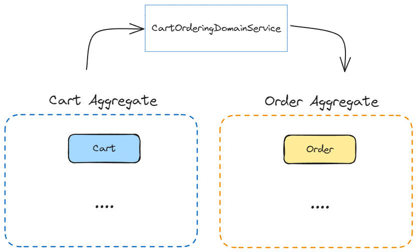

# 전술적 설계 (Tactical Design)

전술적 설계는 마이크로서비스 아키텍처의 한 부분으로, 각 마이크로서비스 내부의 비즈니스 로직을 어떻게 구현할지에 대한 설계를 의미합니다. 

이벤트 스토밍을 통해 바운디드 컨텍스트, 커맨드, 애그리거트, 도메인 이벤트 등이 도출되며, 이러한 요소들이 마이크로서비스의 내부 구현을 결정하는 데 필요한 입력 요소가 됩니다.


## 마이크로 내부 설계 패턴

### 트랜잭션 스크립트(Transaction Script) 패턴

하나의 트랜잭션으로 구성된 로직을 단일 함수 또는 단일 스크립트에서 처리하는 구조를 가지는 패턴입니다. 일반적으로 서비스 레이어에서 직접 데이터베이스에 접근하여 데이터를 조회하거나 조작하는 방식으로 구현됩니다.

- 각각의 트랜잭션 스크립트들이 특정 작업을 위해 맞춤화되어 있어, 로직의 재사용성이 제한적입니다.
- 핵심 하위 도메인 보다는 단순한 지원 하위 도메인에 적합합니다.
- SQL에 종속적이며, 비즈니스 로직이 SQL에 계속 담기게 됩니다.


### 액티브 레코드(Active Record) 패턴

데이터베이스와의 상호 작용을 객체 모델을 통해 수행합니다. 
각 데이터 엔티티(예: 사용자, 주문)는 하나의 객체로 표현되며, 이는 데이터베이스 테이블과 직접 연결됩니다.

- 객체들은 단순하게 getter, setter, save와 같은 메서드만 가지고 있으며, 비즈니스 로직은 서비스 레이어에서 처리됩니다.
- 지원, 일반 하위 도메인에 적합합니다.
- 도메인 모델에 비즈니스 로직을 얼마나 통합 했는지에 따라 액티브 레코드와 도메인 모델 패턴을 구분할 수 있습니다.
- Anemic Domain Model(빈약한 도메인 모델)이라는 비판을 받고 있습니다.

```java
// 서비스 레이어에서 처리
User user = new User();
user.setName("홍길동");
user.setAge(20);
user.save();
```


### 도메인 모델(Domain Model) 패턴

도메인 모델은 비즈니스 로직을 객체에 통합하는 패턴입니다.

- POJO(Plain Old Java Object)를 사용함으로써 인프라와 기술적 관심사를 분리합니다.
- 서비스에서는 단순히 flow(흐름) 처리만 하며 주요 비즈니스 로직은 도메인 모델에 위임(Delegation)하여 처리합니다.


## 애그리거트 패턴

이전 도메인 모델 패턴을 적용하면 도메인 모델이 점점 복잡해지고 거대해질 수 있습니다. (Big Ball of Mud)

그러한 복잡성을 관리할 수 있는 방법 중 하나가 애그리거트 패턴입니다.

- 대부분이 하나의 Entity와 VO로 구성되어 있으며, 하나의 Entity가 애그리거트 루트 역할을 수행합니다.
- 트랜잭션 단위로 애그리거트를 나눌 수 있습니다.

### 용어정리

- 애그리거트(Aggregate): 관련된 객체들의 클러스터로, 하나의 단위로 관리되는 것을 의미합니다. 이는 도메인의 복잡성을 관리하기 위한 방법입니다.
- 애그리거트 루트(Aggregate Root): 애그리거트 내의 모든 객체는 '애그리거트 루트'라고 불리는 단일 엔티티를 통해 접근되어야 합니다. 애그리거트 루트는 애그리거트의 외부와의 모든 상호작용을 관리합니다.


### Value Object

**개념**

- 도메인 표현: DDD에서 VO는 단순한 데이터 전송 객체(DTO)가 아니라, 도메인을 표현하는 중요한 요소입니다. (DTO는 프레젠테이션 계층과 도메인 계층에서 사용되는 구조체 개념입니다.)
- 완전한 개념 표현: VO는 개념적으로 완전한 하나의 개념을 표현하는 데 사용됩니다. 예를 들어, 주소, 이름, 이메일 주소 등은 모두 VO로 표현될 수 있습니다.
- 식별자 부재: VO는 고유한 식별자를 가지지 않습니다. 그들의 정체성은 그들의 속성에 의해 결정됩니다.
- 불변성: VO는 불변성(Immutable)을 가지며, 변경이 필요하다면 새로운 객체를 생성합니다.

**VO의 장점**

- 안전성: VO를 사용하면 객체 내에서 유효성 검사를 수행할 수 있어 더 안전한 객체를 만들 수 있습니다.
- 도메인 표현의 명확성: VO를 사용하면 도메인의 의미를 보다 명확하게 표현할 수 있습니다.
- 유비쿼터스 언어 사용: VO를 사용함으로써 도메인 전문가와 개발자 간의 의사소통이 원활해집니다.

```java
// VO를 사용하지 않은 예시 - 원시 타입 사용
class Person {
    private Long id;
    private String firstName;
    private String lastName;
    private String email;
    private String country;
};

// VO를 사용한 예시
class Person {
    private PersonalId id;
    private Name name;
    private EmailAddress email;
    private CountryCode country;
};
```

VO를 사용하면 도메인의 개념을 더 명확하게 표현할 수 있으며, 유효성 검사를 통해 더 안전한 객체를 만들 수 있습니다. 이러한 접근은 도메인 중심 설계에서 매우 중요한 부분입니다.

### 엔티티(Entity)

- 고유 식별자를 가지며 비지니스 도메인의 중요한 개념을 나타냅니다. (예: 사용자, 주문, 상품 등)
- 모든 도메인의 필수 구성요소이자 고유개념 표현입니다.
- 자신의 생명주기를 가집니다.
- DB 엔티티와 차이는 데이터와 함께 기능을 가지고 있다는 점입니다.

```java
// 엔티티 예시
class User {
    private Long id;
    private String name;
    private String email;
    private String password;
};
```

### 애그리거트(Aggregate)

**개념**

- 관련 객체를 하나의 단위로 묶은 것을 의미합니다. (트랜잭션 단위가 되는 연관된 객체 묶음)
- 애그리거트는 하나의 루트 엔티티와 하나 이상의 엔티티와 값 객체로 구성됩니다.
- 애그리거트는 데이터의 일관성을 보장하기 위해 트랜잭션 경계를 정의합니다.
- 목적은 데이터 일관성 보호, 데이터 변경시 애그리거트 단위로 처리 입니다.
- 애그리거트 루트를 통해 애그리거트 내 다른 엔티티나 VO 객체에 접근할 수 있습니다.
- 같은 애그리거트라면 직접 참조, 다른 애그리거트를 참조해야하면 해당 애그리거트의 ID만 참조해야 합니다.

```java
class A {
    private BId bId; // 다른 애그리거트를 참조할 때는 ID만 참조
    private List<CId> cIds;
    private List<Message> messages; // 같은 애그리거트는 참조
}
```


**설계 예시**

Order가 엔티티이자 애그리거트 루트입니다.


### 도메인 이벤트

- 비지니스 도메인에서 일어난 중요한 이벤트를 설명하는 메세지입니다.
- 과거형으로 표현합니다. (예: 주문이 생성되었습니다.)
- 바운드리 컨텍스트 간의 일관성을 유지하기 위해 사용되는데 애그리거트 간에도 일관성을 유지하기 위해 사용됩니다. (바운드리 컨텍스트가 MS의 단위가 될 수도 있고, 애그리거트가 MS의 단위가 될 수도 있습니다.)

**결과적 일관성**

트랜잭션은 반드시 일관성이 있어야함(ACID, 즉시 일관성)

그러나 결과적 일관성은 트랜잭션 처럼 즉시 일관성을 맞추는 것이 아니라 중간에 메세지 큐 등을 이용해서 비동기 적으로 일관성을 맞추는 것입니다. (이벤트를 던져놓고 다른 애그리거트가 이벤트를 가져가는 것)

즉, 결과적 일관성은 일관성을 유지시켜야 하는 데이터가 일정시간 다른 데이터와 일치 하지 않을 수도 있지만 어느 시점이 되면 결국 일치하는 것을 말합니다.

예시로 주문 완료와 배송 생성 간에 일관성이 맞지 않을 수 있지만, 이벤트를 던져놓고나면 어느 시점에는 일관성이 맞을 수 있습니다.


### domain service

- 여러 개의 애그리거트를 거쳐서 처리해야하는 로직이만 도메인 서비스로 분리



### Repository

- 도메인 모델의 영속성을 처리하는 역할입니다.
- 도메인 객체(애그리거트)에 대한 생명주기, 즉 영속성을 관리합니다. (등록, 수정, 삭제, 조회 시 애그리거트의 일관성 유지)

### 응용 서비스

- 도메인 모델에 속하지 않으나 트랜잭션 처리가 필요한 작업을 수행합니다.
- 응용 서비스 = 서비스(레이어드 아키텍처)


